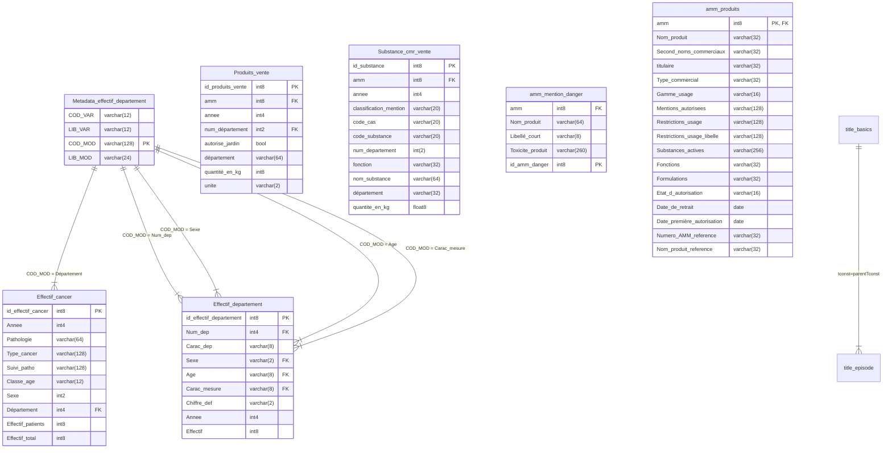

```mermaid
erDiagram
     Effectif_cancer{
        id_effectif_cancer int8 "PK"
        Annee int4 ""
        Pathologie varchar(64) ""
        Type_cancer varchar(128) ""
        Suivi_patho varchar(128) ""
        Classe_age varchar(12) ""
        Sexe int2 ""
        Département int4 "FK"
        Effectif_patients int8 ""
        Effectif_total int8 ""
    }
    
    Effectif_departement{
        id_effectif_departement int8 "PK"
        Num_dep int4 "FK"
        Carac_dep varchar(8) ""
        Sexe  varchar(2) "FK"
        Age varchar(8) "FK"
        Carac_mesure varchar(8) "FK"
        Chiffre_def varchar(2) ""
        Annee int4 ""
        Effectif int8 ""
    }
    
    Metadata_effectif_departement{
        COD_VAR varchar(12) ""
        LIB_VAR varchar(12) ""
        COD_MOD varchar(128) "PK"
        LIB_MOD varchar(24) ""  
    }
    Produits_vente{
        id_produits_vente int8 "PK"
        amm int8 "FK"
        annee int4 ""
        num_département int2 "FK" 
        autorise_jardin bool ""
        département varchar(64) ""
        quantité_en_kg int8 ""
        unite varchar(2) ""
    }

    Substance_cmr_vente{
        id_substance int8 "PK"
        amm int8 "FK"
        annee int4 ""
        classification_mention varchar(20) ""
        code_cas varchar(20) ""
        code_substance varchar(20) ""
        num_departement int(2) ""
        fonction varchar(32) ""
        nom_substance varchar(64) ""
        département varchar(32) ""
        quantite_en_kg float8 ""

    }
    amm_mention_danger{
        amm int8 "FK"
        Nom_produit varchar(64) ""
        Libellé_court varchar(8) ""
        Toxicite_produit varchar(260) ""
        id_amm_danger int8 "PK"
    }
    amm_produits{
        amm int8 "PK, FK"
        Nom_produit varchar(32)
        Second_noms_commerciaux varchar(32) ""
        titulaire varchar(32) ""
        Type_commercial varchar(32) ""
        Gamme_usage varchar(16) ""
        Mentions_autorisees varchar(128) ""
        Restrictions_usage varchar(128) ""
        Restrictions_usage_libelle varchar(128) ""
        Substances_actives varchar(256) ""
        Fonctions varchar(32) ""
        Formulations varchar(32) ""
        Etat_d_autorisation varchar(16) ""
        Date_de_retrait date ""
        Date_première_autorisation date ""
        Numero_AMM_reference varchar(32) ""
        Nom_produit_reference varchar(32) ""
    }
    Metadata_effectif_departement ||--|{ Effectif_cancer : "COD_MOD = Département"
    Metadata_effectif_departement ||--|{ Effectif_departement : "COD_MOD = Num_dep"
    Metadata_effectif_departement ||--|{ Effectif_departement  : "COD_MOD = Sexe"
    Metadata_effectif_departement ||--|{ Effectif_departement  : "COD_MOD = Age"
    Metadata_effectif_departement ||--|{ Effectif_departement  : "COD_MOD = Carac_mesure"
    title_basics ||--|{ title_episode : "tconst=parentTconst"
```