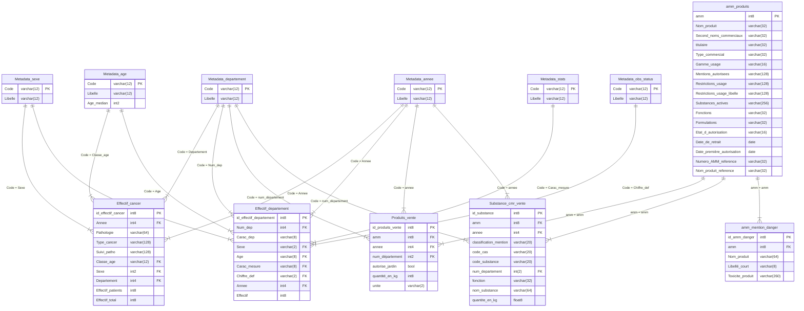

```mermaid
erDiagram
     Effectif_cancer{
        id_effectif_cancer int8 "PK"
        Annee int4 "FK"
        Pathologie varchar(64) ""
        Type_cancer varchar(128) ""
        Suivi_patho varchar(128) ""
        Classe_age varchar(12) "FK"
        Sexe int2 "FK"
        Departement int4 "FK"
        Effectif_patients int8 ""
        Effectif_total int8 ""
    }
    
    Effectif_departement{
        id_effectif_departement int8 "PK"
        Num_dep int4 "FK"
        Carac_dep varchar(8) ""
        Sexe  varchar(2) "FK"
        Age varchar(8) "FK"
        Carac_mesure varchar(8) "FK"
        Chiffre_def varchar(2) "FK"
        Annee int4 "FK"
        Effectif int8 ""
    }
    
    Metadata_annee{
        Code varchar(12) "PK"
        Libelle varchar(12) "" 
    }

    Metadata_age{
        Code varchar(12) "PK"
        Libelle varchar(12) "" 
        Age_median int2 ""
    }


    Metadata_sexe{
        Code varchar(12) "PK"
        Libelle varchar(12) "" 
    }

    Metadata_departement{
        Code varchar(12) "PK"
        Libelle varchar(12) "" 
    }

    Metadata_stats{
        Code varchar(12) "PK"
        Libelle varchar(12) "" 
    }

    Metadata_obs_status{
        Code varchar(12) "PK"
        Libelle varchar(12) "" 
    }

    Produits_vente{
        id_produits_vente int8 "PK"
        amm int8 "FK"
        annee int4 "FK"
        num_département int2 "FK" 
        autorise_jardin bool ""
        quantité_en_kg int8 ""
        unite varchar(2) ""
    }

    Substance_cmr_vente{
        id_substance int8 "PK"
        amm int8 "FK"
        annee int4 "FK"
        classification_mention varchar(20) ""
        code_cas varchar(20) ""
        code_substance varchar(20) ""
        num_departement int(2) "FK"
        fonction varchar(32) ""
        nom_substance varchar(64) ""
        quantite_en_kg float8 ""
    }

    amm_mention_danger{
        id_amm_danger int8 "PK"
        amm int8 "FK"
        Nom_produit varchar(64) ""
        Libellé_court varchar(8) ""
        Toxicite_produit varchar(260) ""
    }

    amm_produits{
        amm int8 "PK"
        Nom_produit varchar(32)
        Second_noms_commerciaux varchar(32) ""
        titulaire varchar(32) ""
        Type_commercial varchar(32) ""
        Gamme_usage varchar(16) ""
        Mentions_autorisees varchar(128) ""
        Restrictions_usage varchar(128) ""
        Restrictions_usage_libelle varchar(128) ""
        Substances_actives varchar(256) ""
        Fonctions varchar(32) ""
        Formulations varchar(32) ""
        Etat_d_autorisation varchar(16) ""
        Date_de_retrait date ""
        Date_première_autorisation date ""
        Numero_AMM_reference varchar(32) ""
        Nom_produit_reference varchar(32) ""
    }


    Metadata_departement ||--|{ Effectif_cancer : "Code = Departement"
    Metadata_annee ||--|{ Effectif_cancer : "Code = Annee"
    Metadata_sexe ||--|{ Effectif_cancer  : "Code = Sexe"
    Metadata_age ||--|{ Effectif_cancer  : "Code = Classe_age"
    Metadata_departement ||--|{ Effectif_departement : "Code = Num_dep"
    Metadata_annee ||--|{ Effectif_departement : "Code = Annee"
    Metadata_sexe ||--|{ Effectif_departement  : "Code = Sexe"
    Metadata_age ||--|{ Effectif_departement  : "Code = Age"
    Metadata_stats ||--|{ Effectif_departement  : "Code = Carac_mesure"
    Metadata_obs_status ||--|{ Effectif_departement  : "Code = Chiffre_def"
    Metadata_departement ||--|{ Produits_vente : "Code = num_département"
    Metadata_annee ||--|{ Produits_vente : "Code = annee"
    Metadata_departement ||--|{ Substance_cmr_vente : "Code = num_département"
    Metadata_annee ||--|{ Substance_cmr_vente : "Code = annee"
    amm_produits ||--|{ Produits_vente : "amm = amm"
    amm_produits ||--|{ Substance_cmr_vente : "amm = amm"
    amm_produits ||--|{ amm_mention_danger : "amm = amm"
```